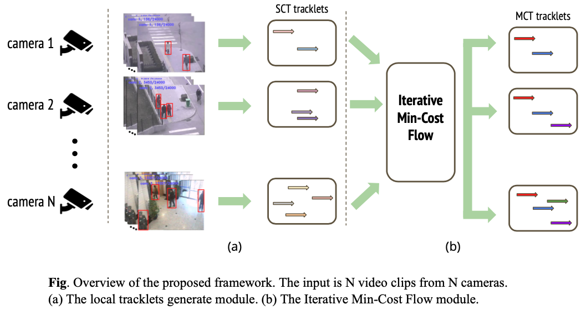

# non-overlapping_multiple-camera_tracking

This work references [An equalized global graph model-based approach for multi-camera object tracking](https://arxiv.org/pdf/1502.03532.pdf).

### Dataset

This work uses [NLPR_MCT dataset](http://www.mct2014.com)  
After downloading the dataset, run `dat2csv.py` to change dat files to csv files.  

	python dat2csv.py --source PATH/TO/ANNOTATION --dataset DATASET_NO

### Method

The association algorithm is iterative min-cost-flow.  
The overview approach is shown in below:  

### Experiments

The evaluation metrics including [MCTA](https://github.com/lockxuan/python-MCTA-Multiple-Camera-Tracking-Accuracy), mmes, and mmec.

Dataset 1
|Method           |MCTA ↑  |mmec (inter) ↓ |mmes (intra) ↓ |
|-----------------|--------|---------------|---------------|
|EGM              |85.25 % |49             |66             |
|IMCF (this work) |84.01 % |53             |59             |

Dataset 2
|Method           |MCTA ↑  |mmec (inter) ↓ |mmes (intra) ↓ |
|-----------------|--------|---------------|---------------|
|EGM              |73.7  % |93             |107            |
|IMCF (this work) |85.76 % |60             |110            |

Dataset 3
|Method           |MCTA ↑  |mmec (inter) ↓ |mmes (intra) ↓ |
|-----------------|--------|---------------|---------------|
|EGM              |47.24 % |80             |51             |
|IMCF (this work) |31.77 % |133            |82             |

Dataset 4
|Method           |MCTA ↑  |mmec (inter) ↓ |mmes (intra) ↓ |
|-----------------|--------|---------------|---------------|
|EGM              |37.78 % |159            |128            |
|IMCF (this work) |28.52 % |177            |166            |

### How to run?

#### requirements
- opencv-python==4.5.5
- torchreid

#### showing videos
	python display.py --dataset NO. --data_path PATH/TO/NPLR/DATA --annotation PATH/TO/ANNOTATION --bbox

#### tracking

run the modules seperately (take sub-dataset 1 as example)
	
	python run_sct.py --dataset 1 --cid 1
	python run_sct.py --dataset 1 --cid 2
	python run_sct.py --dataset 1 --cid 3
	python run_mct.py --dataset 1

> **NOTE**    the reid model is downloaded from [torchreid model zoo](https://kaiyangzhou.github.io/deep-person-reid/MODEL_ZOO.html)

